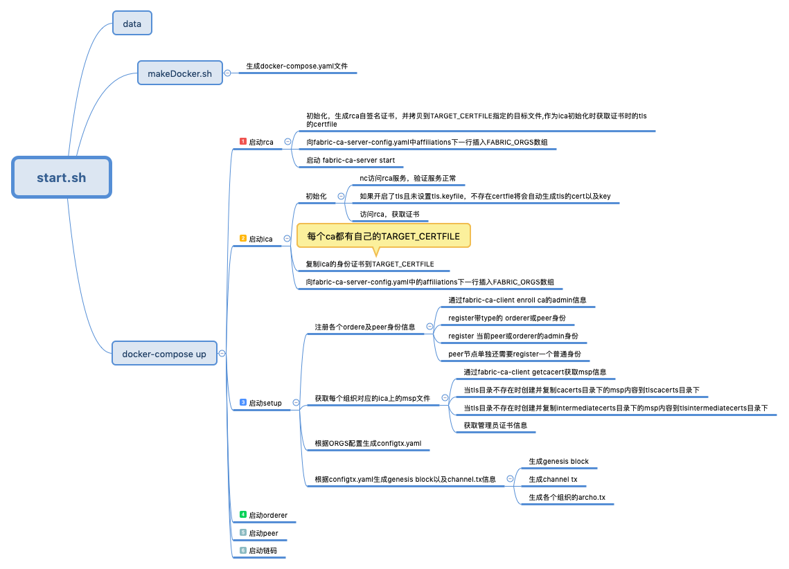

## 二级ca启动过程整体思维导图

- [各个节点配置说明](二级ca配置说明.md)

## License

Dashboard API Project source code files are made available under the Apache License, Version 2.0 (Apache-2.0), located in the LICENSE file. Dashboard API Project documentation files are made available under the Creative Commons Attribution 4.0 International License (CC-BY-4.0), available at http://creativecommons.org/licenses/by/4.0/.
