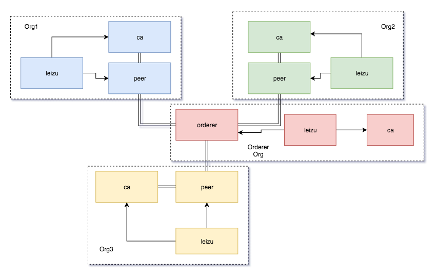
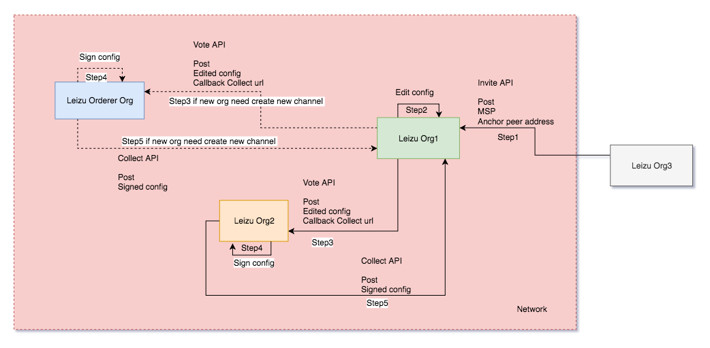

## Scenario: Brief Introduction of Leizu

### Why Leizu

[Leizu (Chinese: 嫘祖)](https://en.wikipedia.org/wiki/Leizu), was a legendary Chinese empress and wife of the Yellow Emperor. She invented the silk loom in the 27th century BC.

### Why we build it

* Until now there is not any lightweight blockchain management system which can help users to customize their blockchain network with their own infrastructure, this gap is what Leizu hope to fill.
* To manage the blockchain network in decentralised-governance manner
* Deploy the customized the fabric network automatically

### System architecture

* Resource layer
* Orchestration layer
* Application layer
* Logging and monitoring
* Credentials store and DNS service \[*Optional*\]

### Deployment Architecture

### Governance Flow
* Off chain approach

* On chain approach

The whole process is similar with off chain approach, whereas may use a `system chaincode` per channel to store the messages(e.g.edited config, signed config), it can reduce several interactions since it use ledger to share the information.

### Features
* Overview
* Organization Management
  * Create new organizations
  * List organizations
  * Create new nodes
  * List nodes of organization
* Channel Management
  * Create new channels
  * List channels
* Node Management
  * Create new nodes
  * List nodes
* Logging

### Roadmap
* Chaincode management
* Governance API
* Cloud agnostic resources provisioning
* Kubernetes support
* Integrate the metrics introduced in Fabric 1.4
* Credentials management through vault
